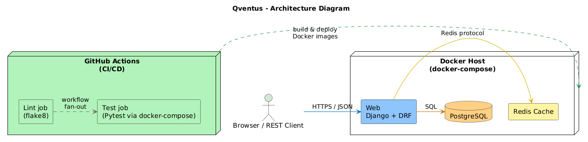
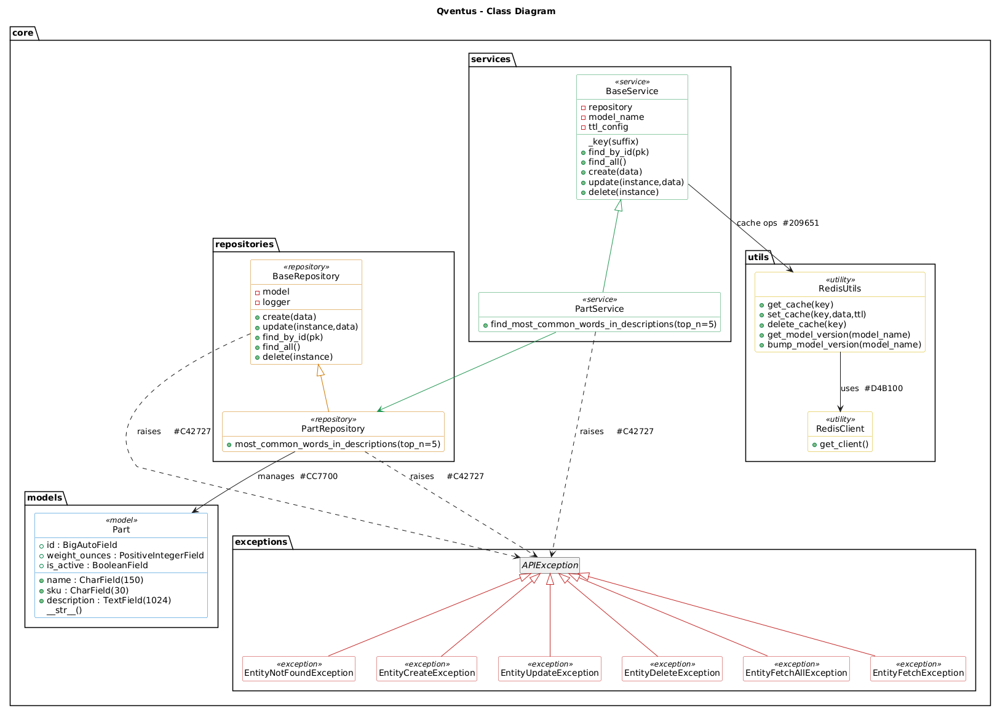
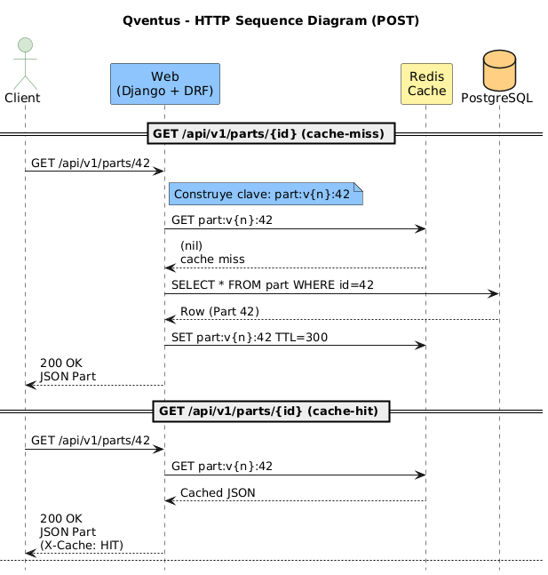

# 🧠 Qventus API – Parts Management System

This is a modern and scalable Django-based API for managing **parts inventory**, equipped with:

- ✅ Clean architecture: services, repositories, and utilities.
- 🐳 Dockerized environment with PostgreSQL and Redis.
- 🎯 Automatic code linting using `flake8`.
- 🧪 Unit testing via SQLite + Docker + GitHub Actions.
- 📊 Swagger UI documentation with `drf-yasg`.

---

## 🖼️ Diagrams

### System Architecture


### Class Design


### HTTP Sequence Flow



## 🚀 Quickstart (Development)

```bash
cp .env.example .env
docker compose up --build
```

## Run Tests
```bash
make test
```

## Endpoints

local: http://localhost:8000

| Method            | Path                                   | Description                                            |
|-------------------|----------------------------------------|--------------------------------------------------------|
| **GET**           | `/api/v1/parts`                        | List all parts                                         |
| **POST**          | `/api/v1/parts`                        | Create a new part                                      |
| **GET**           | `/api/v1/parts/{id}`                   | Retrieve a specific part by **ID**                     |
| **PUT** / **PATCH** | `/api/v1/parts/{id}`                 | Update an existing part                                |
| **DELETE**        | `/api/v1/parts/{id}`                   | Delete an existing part                                |
| **GET**           | `/api/v1/parts/most-common-words/`     | Get the most frequent words in part descriptions       |
| **GET**           | `/swagger`                             | OpenAPI docs (Swagger UI)                              |
| **GET**           | `/redoc`                               | OpenAPI docs (ReDoc)                                   |


